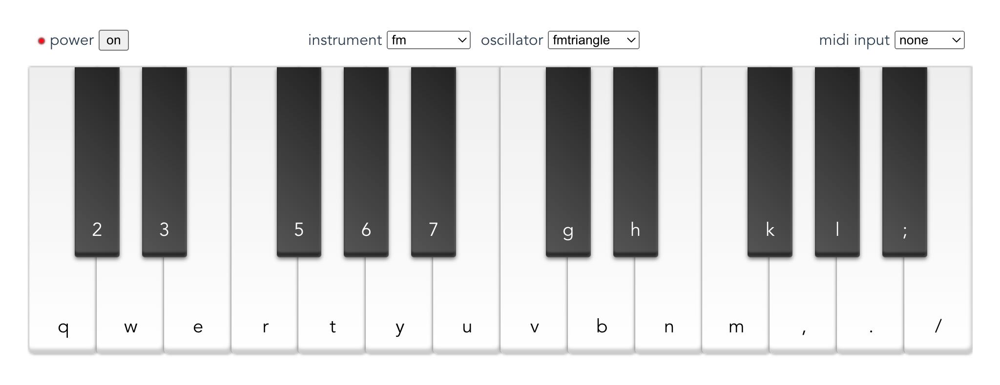

# Tone Synth
A little browser synth created with [Tone.js](https://tonejs.github.io/) and the Web MIDI API.

Try it [here](https://seanwilson.dev/tone-synth/).

Preview:

The keyboard-style UI was created using [Vue.js](https://vuejs.org/). It supports playing notes by clicking on the piano keys, typing the corresponding keys, or via connected midi devices. Just click the power button, then select your instrument and oscillator.
